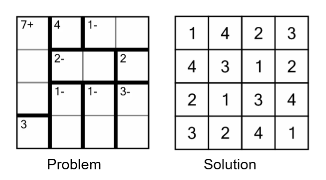

# Calcudoku Solver

## What is Calcudoku?

Calcudoku, also known as KenKen, is a logic-based numerical puzzle that combines elements of Sudoku and arithmetic. The goal is to fill an \(n \times n\) grid with numbers ranging from 1 to \(n\) while satisfying specific mathematical and positional constraints.

## Rules of Calcudoku

### Row and Column Constraints:
- Each number from 1 to \(n\) must appear exactly once in every row and every column.

### Cage Constraints:
- The grid is divided into outlined regions, called **cages**. Each cage has a target number and a mathematical operation (e.g., addition, subtraction, multiplication, or division). The numbers in the cells of the cage must:
  1. Satisfy the given operation to reach the target.
  2. Be unique within the cage.

### Operations:
- **Addition (+)**: The numbers in the cage must sum up to the target number.
- **Subtraction (-)**: For a two-cell cage, the difference between the larger and smaller number must equal the target.
- **Multiplication (×)**: The numbers in the cage must be multiplied by the target number.
- **Division (÷)**: For a two-cell cage, the quotient of the larger number divided by the smaller must equal the target.

## Example Problem and Solution:




## How to Run the Code

### Prerequisites:
- Ensure you have access to [Google Colab](https://colab.research.google.com/).

### Steps to Run:
1. **Open Google Colab**:
   - Visit [Google Colab](https://colab.research.google.com/).

2. **Upload the Input File**:
   - In the Colab interface, click on the **Files** tab on the left-hand side.
   - Use the **Upload** button to upload your input file (e.g., `input1.txt`).

3. **Set the Input File Name**:
   - Update the `inputFile` variable in the `main()` function within the code:
     ```python
     inputFile = "input1.txt"
     ```

4. **Run the Code**:
   - Paste the code into a new Colab notebook.
   - Execute the code cell. The output (solution grid) will appear in the notebook.

### Website for more puzzle:
It can solve https://www.calcudoku.org/  puzzle. Till I tried I solved, now know about now.

### Sample Input and Output:
**Input File:**
- Create a text file named input1.txt on your computer.
- Copy and paste the below content into the file.
- Upload input1.txt to the Files section in Google Colab as described in the "How to Run the Code" section of your README.
```
4 4  // size of the grid
9    // number of blocks

7+   // clue for block 1
1 1 2 1 3 1  // cell positions of the block

4    // clue for block 2
1 2  // cell position for the block

1-   // clue for block 3
1 3 1 4  // cell positions for the block

2-   // clue for block 4
2 2 2 3

2    // clue for block 5
2 4

3    // clue for block 6
4 1

1-   // clue for block 7
3 2 4 2

1-   // clue for block 8
3 3 4 3

3-   // clue for block 9
3 4 4 4
```

**Output:**
```
1 4 2 3
4 3 1 2
2 1 3 4
3 2 4 1
```

## Future Improvements

### Forward Checking Integration

The current implementation of the Calcudoku Solver utilizes backtracking to explore potential solutions. A basic form of forward checking is present in the code, where invalid numbers for the current cell are pruned before attempting assignments. This is achieved through the checkValid function, which ensures that assigned numbers comply with the rules of rows, columns, and block constraints.

However, the forward checking in this implementation is limited in scope. It does not actively propagate constraints to future cells. In other words, while the solver eliminates invalid numbers for the current cell, it does not dynamically update the potential domains of unassigned cells based on the current assignment.

---

## Contributing

Feel free to fork this repository, make improvements, and submit a pull request! Whether you want to optimize the algorithm, add new features your contributions are welcome.

---

Thank you for exploring the Calcudoku Solver. Happy coding and puzzle-solving!
